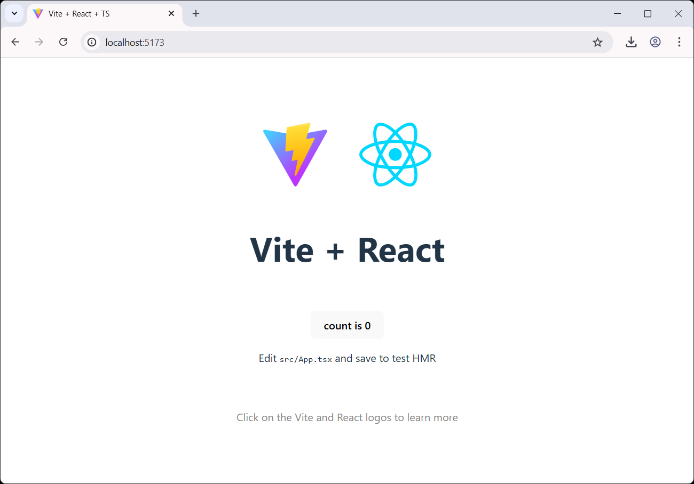
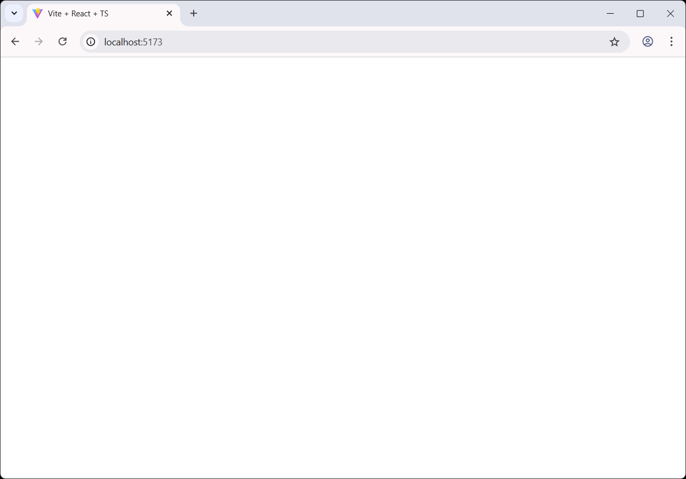
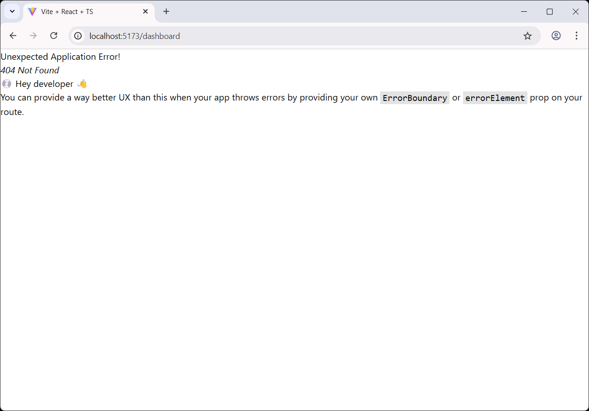
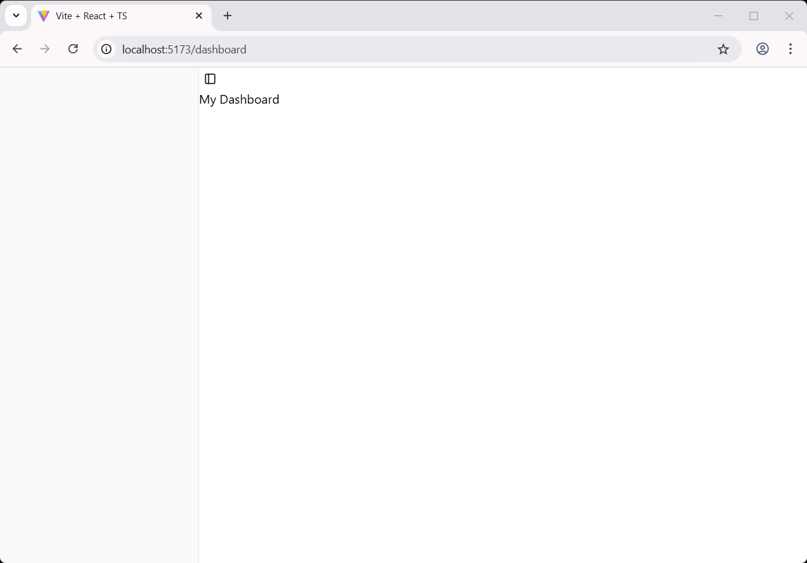
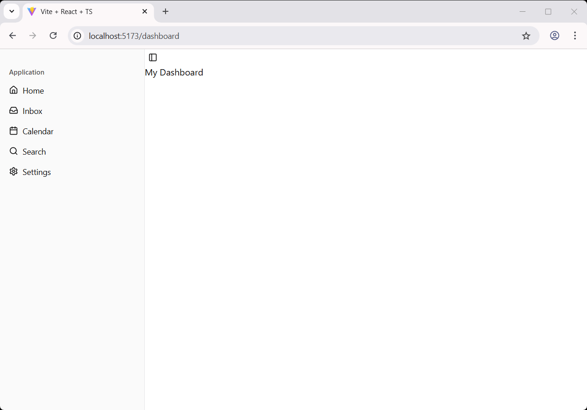

# Initialize The Web App

This is the first articles of building a web app with following components:
- Frontend service built using [React](https://react.dev/) + [Vite](https://vite.dev/)
- UI components using [shadcn/ui](https://ui.shadcn.com/)
- Backend service using [Django](https://www.djangoproject.com/)

The final code of this article available as a branch on https://github.com/tibrahimdev/web-app-django-vite-shadcn/tree/%231-initial#

## The Goals
- No backend APIs involved yet
- A single page on `/dashboard` path showing a colapsible sidebar
- Other path will return 404 page
- Create great UI with the help of `shadcn/ui` components

## Initialize the UI
We will start by scaffolding a new Vite project -- following [Scaffolding Your First Vite Project](https://vite.dev/guide/#scaffolding-your-first-vite-project).

We will use `node 22` and `pnpm` through the entire project

```bash
pnpm create vite frontend --template react-ts .
```

It will print output like this:
```bash
│
◇  Scaffolding project in /home/user/web-app-django-vite-shadcn/frontend...
│
└  Done. Now run:

  cd frontend
  pnpm install
  pnpm run dev
```

As mentioned above, let's move to `frontend` directory and run that two commands.
```bash
  VITE v6.2.2  ready in 183 ms

  ➜  Local:   http://localhost:5173/
  ➜  Network: use --host to expose
  ➜  press h + enter to show help
```

We will have the UI accessible on http://localhost:5173.



Let's do few things stupid here:
- Delete `frontend/src/App.css`
- Delete `frontend/src/App.tsx`
- Edit the `frontend/src/main.tsx` into a very simple page contain a simple text **The Web App**. 

Previously, it should looks like this:

```jsx
import { StrictMode } from 'react'
import { createRoot } from 'react-dom/client'
import './index.css'
import App from './App.tsx'

createRoot(document.getElementById('root')!).render(
  <StrictMode>
    <App />
  </StrictMode>,
)
```

Now, let's change it into this:
```jsx
import { StrictMode } from 'react'
import { createRoot } from 'react-dom/client'
import './index.css'

createRoot(document.getElementById('root')!).render(
  <StrictMode>
  </StrictMode>,
)
```

Short explanation:
- Above code creates a basic React app and displays a webpage.
- It imports React, ReactDOM, and a CSS file for styling.
- `createRoot(document.getElementById('root')!)` finds the `<div id="root">` in `index.html`.
- `StrictMode` helps catch common mistakes in development.
- `.render(...)` puts whatever content inside it.

The UI will become as simple as this empty page:


## Setting Up Routing
Back to our goals, we wanted to have a `/dashboard` path to be rendered and other URLs to be served using 404 not found page. That goals requires a mechanism called routing. This is very basic, somewhat forgotten, but we will do this as early as possible on our project.

To do that, we will use a popular library called [React Router](https://reactrouter.com/), which state itself as *A user‑obsessed, standards‑focused, multi‑strategy router you can deploy anywhere*.

There are 3 modes of routing available on React Router. To help developer decide which mode should be taken, React Router has a great documentation on [Picking a Mode](https://reactrouter.com/start/modes#picking-a-mode).

On this project, we will use the [Data](https://reactrouter.com/start/data/custom) mode, since it's allow us to build a more customized and more controls.

### React Router Installation
```bash
pnpm add react-router
```

### Creating the Router
Start by creating an empty file on `frontend/src/router.tsx`. Populate it with following content:

```tsx
// frontend/src/router.tsx
import { createBrowserRouter } from "react-router";

export const router = createBrowserRouter([
  {
    path: "/",
  }
]);
```

As stated in the [documentation](https://reactrouter.com/start/data/custom#1-create-a-router), we will use `createBrowserRouter` which takes an array of route objects that support loaders, actions, error boundaries and more. For now, we have the root path `"/"` with nothing else.

Let's render the router by adding `<RouterProvider>` in the `frontend/src/main.tsx`:
```tsx
// frontend/src/main.tsx
import { StrictMode } from 'react'
import { createRoot } from 'react-dom/client'
import './index.css'
import { RouterProvider } from 'react-router'
import { router } from './router'

createRoot(document.getElementById('root')!).render(
  <StrictMode>
    <RouterProvider router={router} />
  </StrictMode>,
)
```

Now, if we save it and try to navigate to http://localhost:5173, the same empty page will be rendered. But, if we try to navigate to http://localhost:5173/dashboard, it will show an error page saying *Unexpected Application Error! 404 Not Found* and tells use to provide **ErrorBoundary** or **errorElement**. We'll get back to that later. For now, let's focus on how to show `/dashboard` first.


### Routing to /dashboard
This section shows on how render a correct page for `/dashboard` and get rid of the 404 not found page.

Let's start by adding a child on our router:
```tsx
import { createBrowserRouter } from "react-router";

export const router = createBrowserRouter([
  {
    path: "/",
    children: [
      {
        path: "dashboard",
      }
    ]
  }
]);
```

We have added a child, which consist of an array of single object, with a `path` equal to `dashboard`.

Now, if we go back to our browser, it will show an empty page instead of a 404!

Try to put something else like http://localhost:5173/users and you will get the same 404. But that's expected. At this point, we have our router working 🎉.

Next, we will working on the user interface 🚀.

## Working on the User Interface
### Install shadcn/ui

Let's continue by installing `shadcn/ui`. This is a beautiful UI component framework which let us to be more productive on building user interface.

`shadcn/ui` provides a lot of option to install on https://ui.shadcn.com/docs/installation. As we are using `vite`, we will just follow the instruction on https://ui.shadcn.com/docs/installation/vite.

As we already scaffold our Vite app, we can just continue with the next section on that documentation which is **2. Add Tailwind CSS**.

```bash
pnpm add tailwindcss @tailwindcss/vite
```

The documentation says: Replace everything in `src/index.css` with the following:
```ts
// src/index.css
@import "tailwindcss";
```

Next, we move to **3. Edit tsconfig.json file**. Based on `shadcn/ui` explanation, it says that the current version of Vite splits TypeScript configuration into three files, two of which need to be edited. Add the `baseUrl` and `paths` properties to the `compilerOptions` section of the `tsconfig.json` and `tsconfig.app.json` files:

```json
// frontend/tsconfig.json
{
  "files": [],
  "references": [
    {
      "path": "./tsconfig.app.json"
    },
    {
      "path": "./tsconfig.node.json"
    }
  ],
  "compilerOptions": {
    "baseUrl": ".",
    "paths": {
      "@/*": ["./src/*"]
    }
  }
}
```

Add this into `compilerOptions` section of `frontend/tsconfig.app.json`:
```json
// frontend/tsconfig.app.json
{
  "compilerOptions": {
    // ...
    "baseUrl": ".",
    "paths": {
      "@/*": [
        "./src/*"
      ]
    }
    // ...
  }
}
```

Next, on the **5. Update vite.config.ts**. We need to install `@types/node` then edit `vite.config.ts`.

```bash
pnpm add -D @types/node
```

```ts
// frontend/vite.config.ts
import path from "path"
import tailwindcss from "@tailwindcss/vite"
import react from "@vitejs/plugin-react"
import { defineConfig } from "vite"

// https://vite.dev/config/
export default defineConfig({
  plugins: [react(), tailwindcss()],
  resolve: {
    alias: {
      "@": path.resolve(__dirname, "./src"),
    },
  },
})
```

Next, we will run the shadcn init command to setup our project:
```bash
pnpm dlx shadcn@latest init
✔ Preflight checks.
✔ Verifying framework. Found Vite.
✔ Validating Tailwind CSS config. Found v4.
✔ Validating import alias.
✔ Which color would you like to use as the base color? › Neutral
✔ Writing components.json.
✔ Checking registry.
✔ Updating src/index.css
✔ Installing dependencies.
✔ Created 1 file:
  - src/lib/utils.ts

Success! Project initialization completed.
You may now add components.
```

You see, the `shadcn/ui` understand that we're using `Vite` as the framework. We choose `Neutral` as the color theme. Well you can try other themes as well.

### Creating the Sidebar on the Dashboard Page
Let's get back to one our goals: *A single page on `/dashboard` path showing a colapsible sidebar*.

We will leverage the `shadcn/ui` component called [Sidebar](https://ui.shadcn.com/docs/components/sidebar).

First, let's install the component. All `shadcn/ui` components can be easily installed with the same command pattern.
```bash
pnpm dlx shadcn@latest add sidebar
```

Above command will print out few stuff like these:
```bash
✔ Checking registry.
✔ Updating src/index.css
✔ Installing dependencies.
✔ Created 8 files:
  - src/components/ui/sidebar.tsx
  - src/components/ui/button.tsx
  - src/components/ui/separator.tsx
  - src/components/ui/sheet.tsx
  - src/components/ui/tooltip.tsx
  - src/components/ui/input.tsx
  - src/hooks/use-mobile.ts
  - src/components/ui/skeleton.tsx
```

The command automatically creating 8 components which are the dependencies of the `sidebar` component. You can check the documentation on each of the component on https://ui.shadcn.com/docs/components/.

One big thing is, the command also update the `frontend/src/index.css`!

In the past, creating sidebar can be a long job. We'll see on this section how productive can we be using a wonderful UI framework such as `shadcn/ui`.

As written in x, now we need to create a file called `frontend/src/app/layout.tsx` with following content:
```tsx
// frontend/src/app/layout.tsx
import { SidebarProvider, SidebarTrigger } from "@/components/ui/sidebar"
import { AppSidebar } from "@/components/app-sidebar"

export default function Layout({ children }: { children: React.ReactNode }) {
  return (
    <SidebarProvider>
      <AppSidebar />
      <main>
        <SidebarTrigger />
        {children}
      </main>
    </SidebarProvider>
  )
}
```

As you can see, it's importing another file `frontend/src/components/app-sidebar.tsx`, which not exist yet. So, let's create it:
```tsx
// frontend/src/components/app-sidebar.tsx
import {
  Sidebar,
  SidebarContent,
  SidebarFooter,
  SidebarGroup,
  SidebarHeader,
} from "@/components/ui/sidebar"

export function AppSidebar() {
  return (
    <Sidebar>
      <SidebarHeader />
      <SidebarContent>
        <SidebarGroup />
        <SidebarGroup />
      </SidebarContent>
      <SidebarFooter />
    </Sidebar>
  )
}
```

Now, you probably ask, why should we create those 2 files? And where's our dashboard page?

Relax, now it's the right time to go back to our long-awaited dashboard -- with a few more things to do.

Remember our router? Last time, we defined a route to `/dashboard` and we get an empty page. Why? Because we haven't define the component to render the dashboard. Let's define then.

```tsx
// frontend/src/router.tsx
import { createBrowserRouter } from "react-router";

export const router = createBrowserRouter([
  {
    path: "/",
    children: [
      {
        path: "dashboard",

        // +++ lazy loading component
        lazy: async () => ({
          Component: (await import("@/pages/dashboard")).default
        }),
      }
    ]
  }
]);
```

Now, the http://localhost:5173 will show you a scary-error-page saying **Failed to resolve import "@/pages/dashboard" from "src/router.tsx"**

That is because we haven't create `frontend/src/pages/dashboard/index.tsx`. Let's create it with following content:
```tsx
// frontend/src/pages/dashboard/index.tsx
import Layout from "@/app/layout";

export default function Page() {
  return (
    <Layout>
      <div>
        <h1>My Dashboard</h1>
      </div>
    </Layout>
  )
}
```
The simple rule is, the `index.tsx` must return an exported React component.

Now, let's head back to our browser and see!


### Populate the Sidebar Menu
I believe you've stopped smiling now because you realized: There's no menu on that sidebar.

Let's add it then. Back to `frontend/src/components/app-sidebar.tsx`!

```tsx
// frontend/src/components/app-sidebar.tsx
import {
  Sidebar,
  SidebarContent,
  SidebarFooter,
  SidebarGroup,
  SidebarGroupContent,
  SidebarGroupLabel,
  SidebarHeader,
  SidebarMenu,
  SidebarMenuButton,
  SidebarMenuItem,
} from "@/components/ui/sidebar"
import { Calendar, Home, Inbox, Search, Settings } from "lucide-react"

export function AppSidebar() {

  const items = [
    {
      title: "Home",
      url: "#",
      icon: Home,
    },
    {
      title: "Inbox",
      url: "#",
      icon: Inbox,
    },
    {
      title: "Calendar",
      url: "#",
      icon: Calendar,
    },
    {
      title: "Search",
      url: "#",
      icon: Search,
    },
    {
      title: "Settings",
      url: "#",
      icon: Settings,
      
    },
  ]

  return (
    <Sidebar>
      <SidebarHeader />
      <SidebarContent>
        <SidebarGroup>
          <SidebarGroupLabel>Application</SidebarGroupLabel>
          <SidebarGroupContent>
            <SidebarMenu>
              {items.map((item) => (
                <SidebarMenuItem key={item.title}>
                  <SidebarMenuButton asChild>
                    <a href={item.url}>
                      <item.icon />
                      <span>{item.title}</span>
                    </a>
                  </SidebarMenuButton>
                </SidebarMenuItem>
              ))}
            </SidebarMenu>
          </SidebarGroupContent>
        </SidebarGroup>
      </SidebarContent>
      <SidebarFooter />
    </Sidebar>
  )
}
```

See what happen now!

